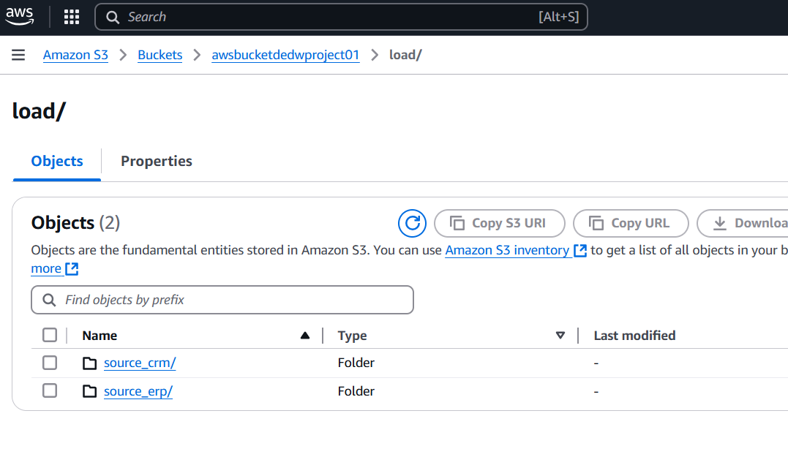

# Data-Engineering-Data-Warehouse-Project-01-AWS
### **Project Overview**
This project aims to build a centralized data warehouse on Amazon Redshift, integrating data from CRM (Customer Relationship Management) and ERP (Enterprise Resource Planning) systems. The solution ensures cost-effective storage by keeping frequently accessed (warm) data in **Amazon Redshift** and less frequently accessed (cold) data in **Amazon S3**, leveraging Redshift Spectrum for seamless querying.

---

### **S3 Bucket**
Storing raw CRM and ERP data.
- Create a bucket in Amazon S3(awsbucketdedwproject01).
- Create a folder.
- Upload the data files to the new Amazon S3 bucket.

### **IAM Role**
- IAM Role for the Redshift cluster will be used to provide access to the data in the S3 bucket.
- AWS service --> Choose a use case --> Redshift --> Select your use case --> Redshift — Customizable --> Attach permissions --> PowerUserAccess

---  
**Note:**
- **Redshift Cluster** is suitable for organizations with large, consistent workloads, offering more control over resources and performance.
- **Redshift Serverless** is ideal for variable or infrequent workloads, offering simplicity and cost-efficiency by automatically scaling resources and charging only for usage.
---

### **Launch Redshift Cluster**
launch a Redshift cluster, which will be used to query the S3-based data.

### **Create Database & Schemas**
